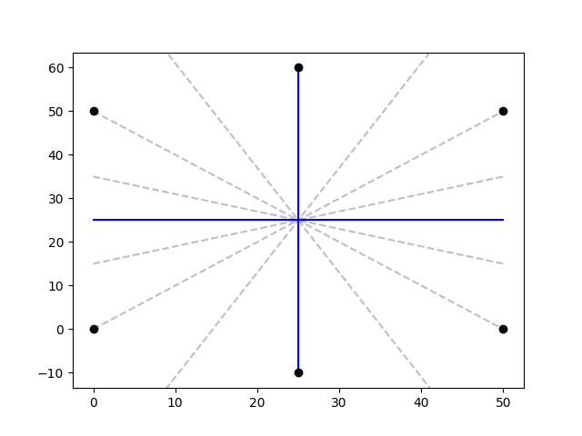
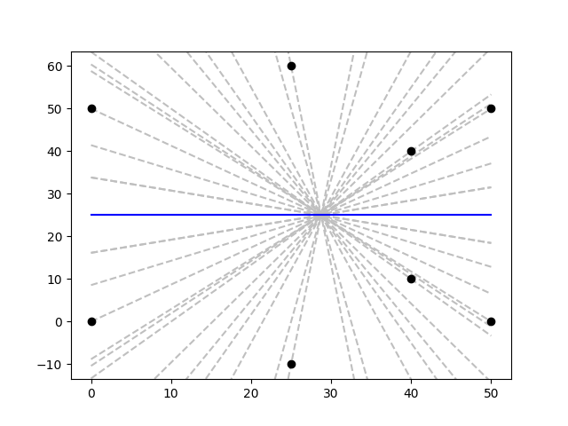

# Lines of Symmetry Coding Exercise

This project finds the lines of symmetry for a set of points on a 2D plane.

The project may be used as a library (python packaging TBD) or as a standalone script.

Executing the Python script file (with `python main.py`) will print formulas for the lines of symmetry of a given set of
points, and optionally produce an image plotting the points, the lines of symmetry, and the candidate lines of symmetry
(lines that were evaluated and determined not to be lines of symmetry).

Below is an example. Two lines of symmetry are shown (solid blue) for a set of six points (black circles), along with
other candidate lines that were evaluated by the algorithm (dashed gray).



## Requirements

Python 3.11

## Quick start

```bash
pip install -r requirements.txt
cat examples/symmetric_six_points.csv | python main.py --graph graph.png

# adjust decimal precision if needed
cat examples/square_high_precision.csv | python main.py --graph graph.png --precision 100
```

A few example input files are provided in `examples/`.

## Algorithm overview

The following properties of the symmetry lines drive the algorithm:

1. Symmetry lines must pass through the centroid (center of gravity) of the set of points.
2. For a given point to be reflected onto one of the points in the set, the point must either
    1. lie on the line of symmetry, OR
    2. the symmetry line bisects a line segment drawn between the point and its reflected point

These observations suggest a finite set of "candidate" lines that we can try to fold the points around.

1. Discard duplicate points from the input.
2. Find the centroid of the input points = (mean of all the X coordinates, mean of all the Y coordinates). Symmetry
   lines must go through this point
3. Construct a set of "candidate" lines described by *y = mx + b* comprised of
    1. Lines that pass through the centroid and any input point.
    2. All lines that bisect any pair of input points. *m* and *b* are computed from the bisection point and the
       centroid.
4. For each candidate line,
    1. "Fold" or reflect the plane along the candidate line.
    2. For each point in the input set,
        1. Compute the point's reflection point.
        2. If the reflection point is not in the input set, then the candidate line cannot be line of symmetry. Discard
           the candidate line and move on to the next.

## Performance

*n* is the number of input points.

Running time is roughly O(*n*<sup>2</sup>) because the algorithm examines 1 centroid line and up to *n* - 1 bisection
lines for each input point.

Memory usage is O(*n*) for the set of points when using the Python generator and tossing each result after it is
yielded. Keeping the results in memory (for example, creating a list from the generator) into a list may use
O(*n*<sup>2</sup>) memory because in the "worst" case every one of the O(*n*<sup>2</sup>/2) candidate lines turns out to
be a symmetry line.

## Floating point precision

The `Line` and `Point` class members are stored as Python `Decimal`s to avoid *some* floating point inaccuracy.

The precision is controlled globally by changing `Decimal.getcontext().prec`. The default precision is 28. In theory,
another user of this program would need to set `prec` based on their needs.

For example, a very high precision would be needed to compare a set of points where some points are very small numbers (
say, on the order of 1e-16 = 0.0000000000000001), and some points are very large numbers (say, on the order of 1e+16 =
10,000,000,000,000,000.0).

Their `__eq__()` and `__hash__()` methods use `Decimal.normalize()` to compare decimals at the Decimal context's
configured precision *minus one*.

## Bells & whistles

Running the Python file as a script will generate a PNG of the points and the lines of symmetry.

However, importing the Python file into another program should not require `matplotlib`.

## Language and style choices

Python because I can implement speedily. Other languages might offer better performance.

Object-oriented Python classes in a single Python script file, plus a unit tests file, because OOP is readable and
extendable.

Separate `symmetry.py` for the functionality, and `main.py` for command line usage, so that another program could
use `symmetry.py` with minimal dependency requirements.

No Python packaging provided in the interest of time.

### What other choices I might have made

* Some examples might not need super-precise symmetry. For example, an image processing application might find
  *approximate* symmetry lines acceptable. For that type of application I would explore ways to compare reflected points
  to input points.
    * For example, use rounding or distance functions to allow reflected points to be "near" the input points instead of
      an exact match. One way this could be accomplished is by changing `__eq__` and `__hash__`.

* More pruning of the candidate lines if possible. You can see the "explosion" of candidate lines by comparing the
  candidates for a six-point input set to those of an eight-point input set:

    
    

* Initializing a `Decimal` with a `float` value can propagate the very floating point issues I wanted to avoid. I went
  back and forth on whether to allow `float` in the constructors for `Line` and `Point` and eventually settled on a
  warning. This was so that my unit tests remained fairly readable.

* Additional unit tests.

* Multi-threading for reduced elapsed running time. The tasks of reflecting the input points over each candidate line
  are independent and could be done in multiple threads (2 threads per hyperthreaded CPU optimal)

